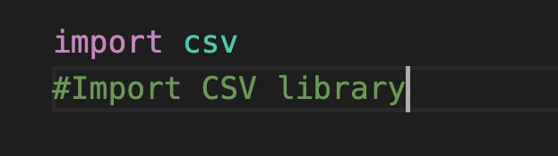
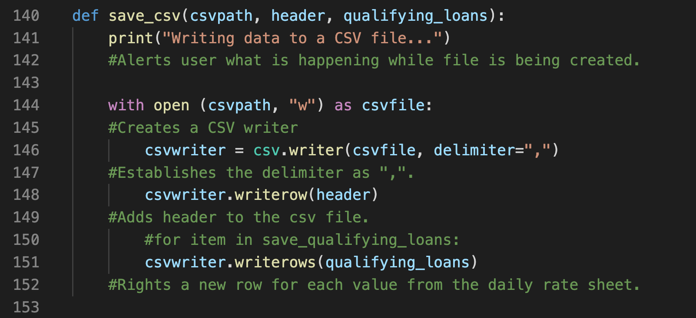
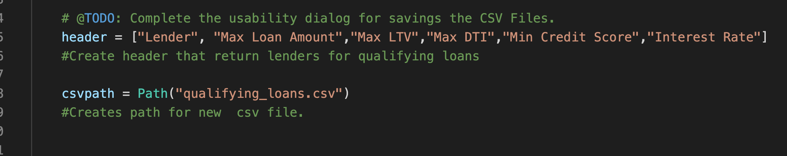
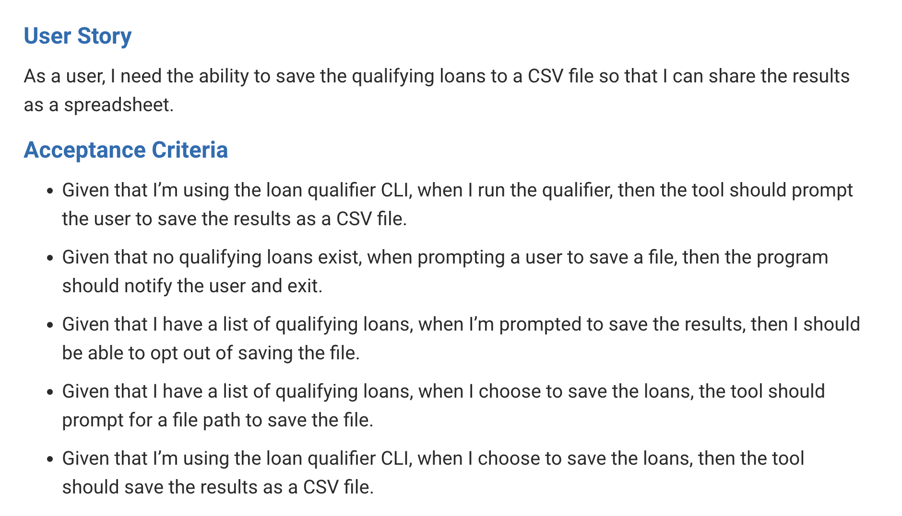
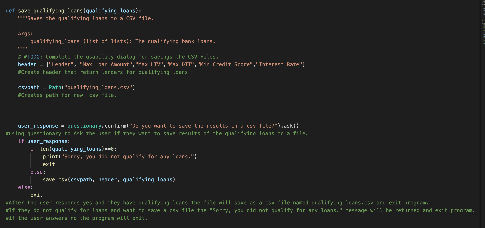
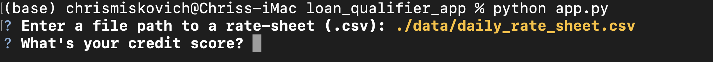
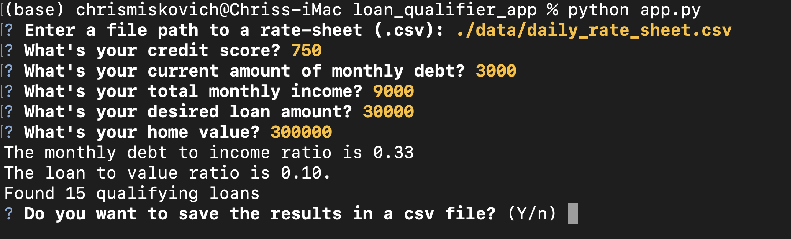
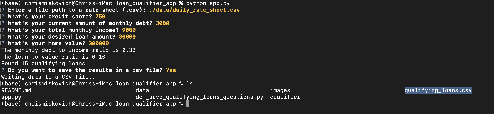
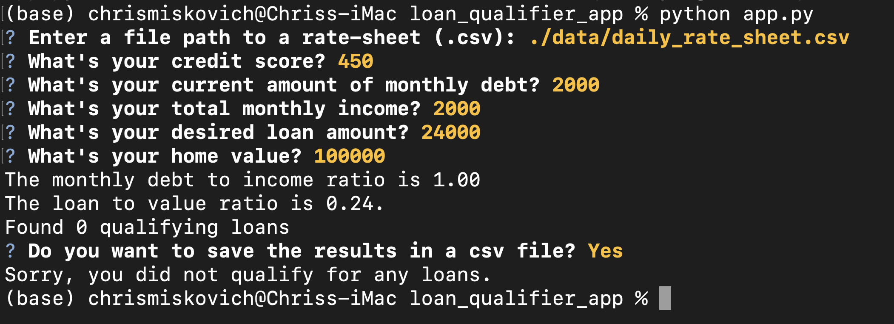
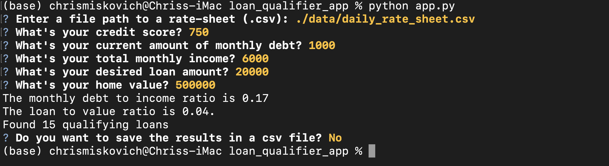

# Primary application file

Using best practices this file will add new features and enhancements to the loan qualifier application.  This will give the end user a comma seperate value file (.csv) of qualifying loans that they can share the results in a spreadsheet.

---

## Technologies

The following Technologies were used to develop this program:

Python 
    Version 3.9.7

Terminal
    Version 2.12.5 (444)

Visual Studio Code
    Version: 1.66.2 (Universal)
    Commit: dfd34e8260c270da74b5c2d86d61aee4b6d56977
    Date: 2022-04-11T07:49:20.994Z
    Electron: 17.2.0
    Chromium: 98.0.4758.109
    Node.js: 16.13.0
    V8: 9.8.177.11-electron.0
    OS: Darwin x64 21.4.0

---

## Installation Guide

First part of improving the application was adding a function labeled save_csv this will save the qualifying loan data as a comma seperated value file (.csv).
    In oder to create this we first had to import the csv libray into the application:

    Next we need to create a function and save it as save_csv. In order to do that we have to identify the variables needed to use in the function for this I used csvpath, header, and qualifying loans.  I then wrote a print line to let the end user know the data is being written to a csv file.  Then using the code with open you sill create a csv writer that is deliminated with a ",", populated with the header from the daily rate sheet, and rows from the qualifying loans for the end user.  The code is captured in the following image.

    I used the header and csvpath variables and they are shown in the screen shot below.

The next part was to create a function to save the data for in a function for the qualifying loans.  We start with a header and the csvpath.
Then using qustionary the application will ask the user if they want to save the results in a csv file.  Using if/else statements we come up with 3 possible outcomes.

    1. The user says yes, has qualifying loans and wants a file of the loans. The file will be created and exit the application.

    2. The user says yes, does not have any qualifying loans and a message appears ("Sorry, you did not qualify for any loans.") and exit application.

    3. The user says no, and exit the application.

These outcomes are based on the user story and the acceptace criteria.

The code is shown below.

---

## Usage

From the loan_qualifier_app folder type: **python app.py**

When prompted for Enter a file path to a rate-sheet (.csv):  type the following **./data/daily_rate_sheet.csv**

Next enter your credit score, monthly debt, monthly income, desired loan amount, and home value.

You are prompted if you want to save the results type "Y" for yes and "N" for no.

If you type "Y" and have qualifying loans a csv file will be created for your qualifying loans and exit the application.

If you type "Y" and do not have qualifying loans a message will appear saying "Sorry, you did not qualify for any loans." and exit the application.

IF you type "N" the application will exit.

---

## Contributors

**Chris Miskovich**

Contact Information:

Email: cmiskovich@verizon.net

[LinkedIn](https://www.linkedin.com/in/christopher-miskovich-9a61b0234/) 

---

## License

[MIT](images/License.txt)
